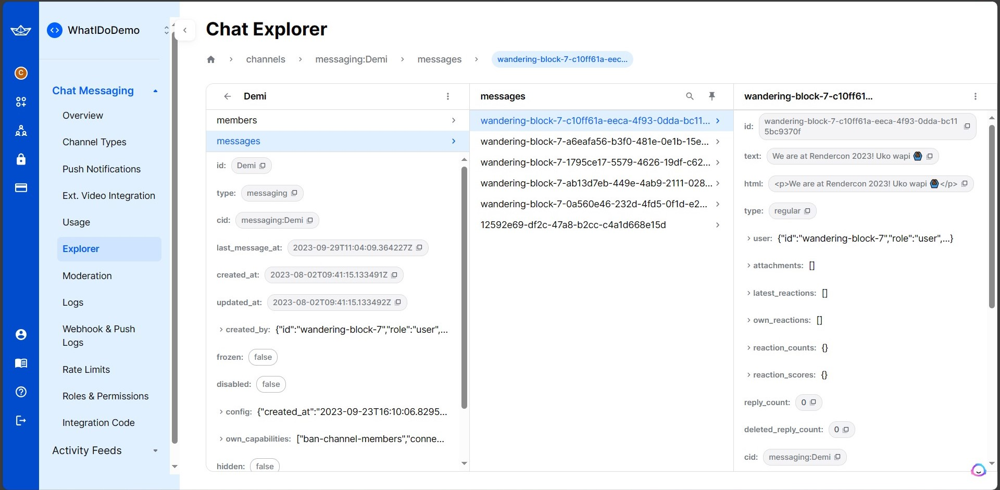
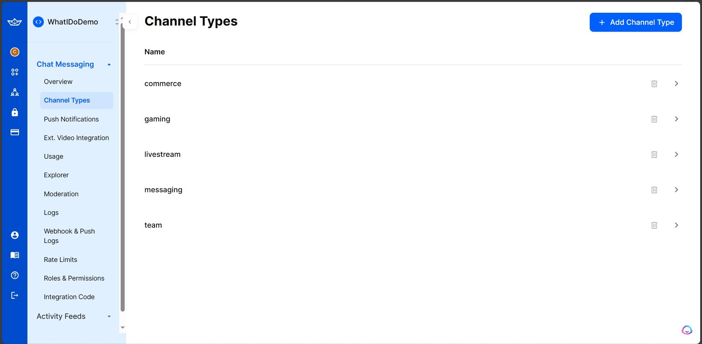
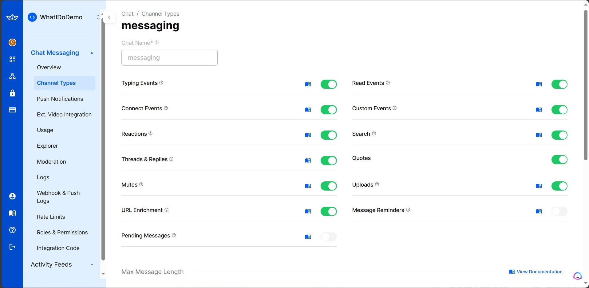
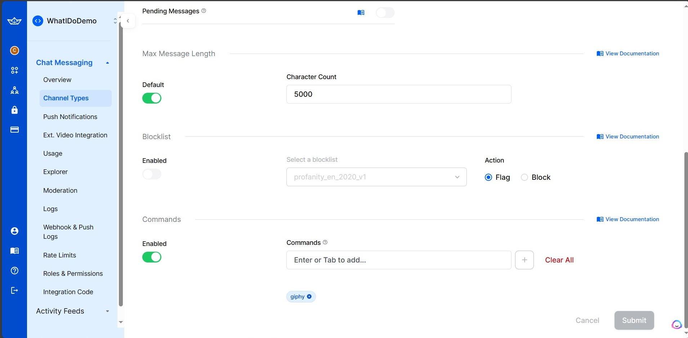

# Table of Contents
- [Table of Contents](#table-of-contents)
  - [Exploring the Synergy of React Native and Stream SDK](#exploring-the-synergy-of-react-native-and-stream-sdk)
  - [Dashboard screenshots](#dashboard-screenshots)
    - [Dashboard showing messages that were sent](#dashboard-showing-messages-that-were-sent)
    - [Dashboard showing the channel types](#dashboard-showing-the-channel-types)
    - [Dashboard showing the channel types settings](#dashboard-showing-the-channel-types-settings)
  - [Prerequisites](#prerequisites)
  - [Setting Up Your React Native Project](#setting-up-your-react-native-project)
  - [Integrating Stream Chat SDK](#integrating-stream-chat-sdk)
  - [Thank you all for coming ☺🥳](#thank-you-all-for-coming-)

## Exploring the Synergy of React Native and Stream SDK

- In today's world, real-time communication is a fundamental part of many applications. Whether it's a messaging app, a support chat, or collaborative workspaces, integrating chat functionality is a common requirement. Stream Chat SDK simplifies this process, making it easier than ever to add chat features to your React Native CLI application. In this repo, we'll walk you through the steps to create a chat application using Stream Chat SDK and React Native CLI.

<iframe src="https://view.officeapps.live.com/op/embed.aspx?src=https%3A%2F%2Fraw%2Egithubusercontent%2Ecom%3A443%2Fcliffgor%2FRenderChat%2Fmaster%2FExploring%2520the%2520Synergy%2520of%2520React%2520Native%2520and%2520Stream%2Epptx&amp;wdAr=1.7777777777777777" width="476px" height="565px" frameborder="0">This is an embedded <a target="_blank" href="https://office.com">Microsoft Office</a> presentation, powered by <a target="_blank" href="https://office.com/webapps">Office</a>.</iframe>

## Dashboard screenshots

### Dashboard showing messages that were sent



- The above screenshot shows messages that are stored inside the stream sdk and were sent by others users
- It shows details like the message id the channel and the user who sent the message

### Dashboard showing the channel types



- The above screenshot shows they channel types you pick to use the StreamSDk in our case we chose the `messaging` which enables one to send chat messages

### Dashboard showing the channel types settings



- The above screenshot shows the messaging settings you can set up for your application



- The above shows a setting used to flag someone 

## Prerequisites

- Before we get started, make sure you have the following prerequisites:

   1. Node.js and npm: Ensure you have Node.js and npm installed on your development machine.
   2. React Native CLI: Set up React Native CLI on your system by following the official documentation.
   3. Stream Chat Account: Sign up for a Stream Chat account at https://getstream.io/chat/ and obtain your API Key.

## Setting Up Your React Native Project

- If you haven't already created a React Native project, you can do so using the following command:
   
   ```
   npx react-native init YourChatApp
   ```
   - Replace YourChatApp with your desired project name.

## Integrating Stream Chat SDK

- Now, let's integrate Stream Chat SDK into your React Native project using the provided code. Copy the code you provided at the beginning of this post into your project. This code sets up a basic chat screen with Stream Chat components.

- Reusability: React Native promotes the use of reusable components. When you integrate Stream SDK, you can create custom chat and activity feed components that can be reused throughout your app, maintaining a consistent look and feel.


## Thank you all for coming ☺🥳